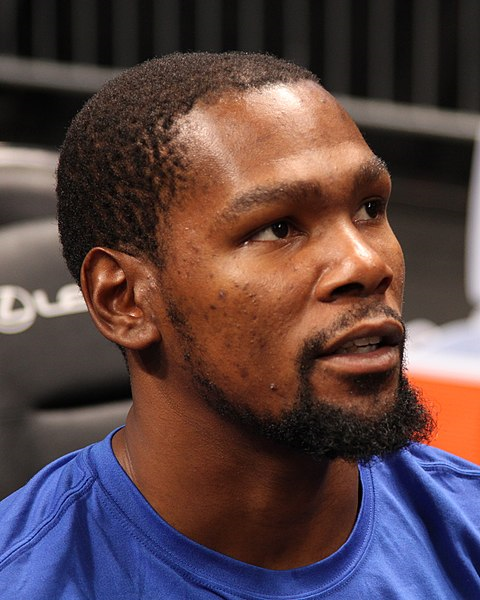

## The Best Team of NBA at Present: Golden State Worriers

### Introduction

After DeMarcus Cousins joined Golden State Worriers before this season, almost everyone believes that the final champion of this season belongs to the ever best team - the Golden State Worriers, who has five all star players. The final win in last two seasons concludes a thrillig regular season for Golden State Warriors in which they dominated the NBA lanscape. The secret of their success is the "Fantastic Four"-- Stephen Curry, Kevin Durant, Draymond Green, and Klay Thomposon. A detailed analysis is provided in this post based on the data of 2016 to show why them five form the ever best team in NBA history, and the reason why we can say that Stephen Curry is a player who has changed the style of NBA from 2014.  

### Background

Founded in 1946 in Philadelphia, the Golden State Warriors are a NBA basketball team based in Oakland of California, and a member of the league's Western Conference Pacific Division. The name was took from San Francisco after relocating to the San Francisco Bay Area in 1962 [1]. The Warriors won the first three championships in 1947, 1956, and 1975. After that, there was period of struggle in the next 40 years before they won the next three championships in 2015, 2017 and 2018. The six NBA championships are tied for third-most in NBA history. It is also the seventh highest valued sports franchise in the United States with an estimated value of approximately $3.1 billion [2]. The Warriors hold several NBA records, such as registered the best ever regular season, most wins in a season, as well as the best ever postseason run. In the past five years, they are credited as one of the greatest backcourts of all time with the combined shooting of Curry and Thompson [3, 4]. 

It should be noted that the start lineup of Golden State Warriors, which are Stephen Curry, Kevin Durant, Draymond Green, and Klay Thomposon, are the key contributors of the team, so we would like to introduce them four first.

Wardell Stephen Curry II was born on March 14, 1988, 6 feet 3 inches tall and weighing 190 pounds. He is an American professional basketball player for the Golden State Warriors of NBA. He has won three NBA championships with the Warriors, six-time NBA All-Star, and twice the NBA Most Valuable Player (MVP) [5]. During the 2012-13 season, Curry set the NBA record for three-pointers made in a regular season with 272. He surpassed that record in 2015 with 286, and again in 2016 with 402. Curry is currently third in all-time made three-pointers in NBA history. The 2012-13 season saw Curry and teammate Klay Thompson earn the nickname of the Splash Brothers, with the pair going on to set the NBA record for combined three-pointers in a season with 484 in 2013-14, a record they broke the following season (525) and again in the 2015-16 season (678). Many players and analysts have called him the greatest shooter in NBA history [6]. He is credited with revolutionizing the game of basketball by inspiring teams to regularly employ the three-point shot as part of their winning strategy [7]. He has career averages of 23.1 points, 6.8 assists, 4.4 rebounds, and 1.8 steals per game [8].

```{r out.width='80%',echo=FALSE,fig.align='center'}

```

Kevin Wayne Durant was born on September 29, 1988, 6 feet 9 inches tall, 240lb. He has won two NBA championships with the Warriors, ten-time NBA All-Star, and one NBA Most Valuable Player (MVP), two Finals MVP Awards, four NBA scoring titles from 2010 to 2014, the NBA Rookie of the Year Award, and two Olympic gold medals, All-NBA honors eight times (2009-14, 2016-18) [9]. He played nine seasons in Oklahoma City before signing with Golden State in 2016, winning back-to-back championships in 2017 and 2018 [10].

```{r out.width='80%',echo=FALSE,fig.align='center'}

```

Klay Alexander Thompson was born on February 8, 1990 [11]. 6 feet 15 inches tall and weighing 185 pounds. He is a five-time NBA All-Star, a two-time All-NBA Third Team honoree, and a three-time NBA champion. In 2014, Thompson and teammate Stephen Curry set a then NBA record with 484 combined three-pointers in a season [12], earning the pair the nickname the "Splash Brothers" [13].

```{r out.width='80%',echo=FALSE,fig.align='center'}

```

Draymond Jamal Green Sr. was born on March 4, 1990, 6 feet 7 inches tall and weighing 230 pounds. He has won three NBA championships with the Warriors, three-time NBA All-Star, the NBA Defensive Player of 2017 [14]. He always play primarily at the power forward position as an undersized center in their Death Lineup [15, 16]. He has also been cited as one of the leaders in an emerging trend in the NBA of versatile frontcourt players capable of playing and defending multiple positions, making plays for teammates and spacing the floor [17].

```{r out.width='80%',echo=FALSE,fig.align='center'}

```

### Data

Before providing a detailed analysis of the team, the data of them four together with that of Iguodala in 2016 are listed in this section. 

```{r}
library(dplyr)
# import data
shots_data <- read.csv("../data/shots-data.csv",stringsAsFactors=FALSE)

# 2PT Effective Shooting % by player
shots_data[shots_data$shot_type=="2PT Field Goal",]%>%
  group_by(name) %>%
  summarise(
    total=n(),
    made=sum(shot_made_flag=="shot_yes"))%>%
    mutate(perc_made=made/total)%>%
    arrange(desc(perc_made))
            
# 3PT Effective Shooting % by player
shots_data[shots_data$shot_type=="3PT Field Goal",]%>%
  group_by(name) %>%
  summarise(
    total=n(),
    made=sum(shot_made_flag=="shot_yes"))%>%
    mutate(perc_made=made/total)%>%
    arrange(desc(perc_made))
            

#  Effective Shooting % by player
shots_data %>%
  group_by(name) %>%
  summarise(
    total=n(),
    made=sum(shot_made_flag=="shot_yes"))%>%
    mutate(perc_made=made/total)%>%
    arrange(desc(perc_made))
       
```

However, the shot type, location and total shots are different due to their different positions in the team, so, the performance of getting the score of the five players will be discussed with their roles on the field in the next section.

### Analysis and discussion

**Curry** plays almost exclusively at the point guard position, he is not considered to be an elite defender. His shoot chart is shown in Fig. 5, from which we can find out that his shooting ability ranges from scoring in great volume from underneath the rim all the way to near half-court. He is so special that he is able to get the ball out of his hands in under half a second by releasing it on the way up, adding extra arc to his shot and making it difficult to block by using an unorthodox jump shot. Specially, he is very good at three ball that he has been referred as "the Michael Jordan of the three-point era," to speak highly of what he did for the three-point shot like what Jordan did for the dunk. In addition, his three ball forces those opposing defenders to double-team him, which creates mismatches that his teammates are able to exploit. He is also known for his ball handling and playmaking abilities, He has been regarded as the greatest shooter in NBA history by many NBA analysts.

**Durant** is best known for his prodigious scoring ability. The shot chart of KD is indicated in Fig. 6. It can be seen from the figure that he can get the score at any place, which is totally different from that of Stephen Curry. KD always act as small forward on the field, he is an excellent off-ball player who was capable of scoring from the outside as well. His 7 ft 4 in wingspan have created matchup problems for defenses as he is able to get off a clean shot regardless of the situation, for example, he converted 72.2% of shots in the paint in 2012. 
 
**Thompson** is a Shooting guard, as well as an elite free-throw shooter. Thompson is primarily a catch-and-shoot player, taking advantage of back-cuts and screens set by teammates to make space for his exceptionally accurate quick-release shot. He is capable of handling the ball in the Warriors offense, as well as a strong defender due to his size at the guard position and ability to defend against both elite guards and wings.

**Draymond Green** is a power forward and a versatile defender on the field, which is capable of guarding all 5 positions as both an interior and perimeter defender, as well as generating rebounds, steals and blocks. Offensively, he can handle the ball on fast breaks and deliver passes to his teammates for scores. He is also known as a capable three-point shooter who provides spacing for the offense by stretching the opposing defense. His outstanding interior defense combined with his offensive repertoire form a unique two-way skill set. His performance in this position enabled the Warriors to create a number of match-up problems for opposing defenses. However, it should be pointed out that his three ball in this season is so bad that most of teams tried to leave him free to double-team the other players.

**Andre Igupdala** act as either Shooting guard or Small forward, he is also the sixth man of the Golden State Warriors. It can be observed from Fig. 9 that he shot less than the other four players mentioned above, however, he is good at playing the play-offs, which he was the FMVP of 2014-2015 season.

```{r out.width='80%',echo=FALSE,fig.align='center'}

```

### Conclusion remarks

The three ball of Stephen Curry, the scoring ability Kevin Durant, defense, handling the ball on fast breaks and deliver passes to his teammates of Draymond Green, and the catch-and-shoot of Klay Thomposon, as well as the remarkable efficient bench, which can be represented by Andre Igupdala, ensure the Golden State Warriors won the three championships in the past 4 year. However, it should be noted that all of Kevin Durant, Draymond Green, and Klay Thomposon will be free agent this summer, and it will cost a lot to keep the lineup for paying the salary of all these three players. So, even though we can say that the Golden State Warriors may be the best team in the NBA history, it is probably that the best team ever will be dissolved after three months.

### References

[1] "Warriors All-Time Yearly Results". Golden State Warriors 2017-18 Media Guide. NBA Properties, Inc. October 16, 2017. Retrieved April 5, 2018.

[2] "Forbes Releases 2018 List Of The World's Most Valuable Sports Teams". Forbes. Retrieved September 30, 2018.

[3] "Ranking 70 Greatest Backcourt Duos in NBA History". NBA.com. December 27, 2017. Retrieved February 23, 2019.

[4] Barney, Chuck (December 21, 2018). "Warriors' Splash Brothers meet the Bad Boys in new TV special". The Mercury News. Retrieved February 23, 2019.

[5] https://en.wikipedia.org/wiki/Stephen_Curry

[6] "Is Steph Curry The Best Shooter Ever? Yes, Say Many of NBA's All-Time Marksmen". Bleacherreport.com. June 1, 2015. Retrieved June 1, 2015.

[7] "Stephen Curry isn't just the MVP -- he is revolutionizing the game". ESPN. Retrieved December 11, 2018.

[8] "Stephen Curry NBA Stats". Basketball Reference. Retrieved January 4, 2019.

[9] https://en.wikipedia.org/wiki/Kevin_Durant

[10] "Kevin Durant NBA & ABA Stats". Basketball Reference. Retrieved May 27, 2013.

[11] "Klay Thompsons's WSUCougars.com Profile". Washington State Cougars. Retrieved March 7, 2015.

[12] Milestones, Bleacher Report. "Steph Curry Sets NBA Record for Most Three-Pointers in a Span of 2 Seasons". bleacherreport.com. Retrieved December 6, 2016.

[13] "Inside Stuff: Golden State's Splash Brothers - NBA.com". nba.com. Retrieved December 6, 2016.

[14] https://en.wikipedia.org/wiki/Draymond_Green

[15] Kawakami, Tim (April 8, 2014). "Kawakami: Draymond Green is Warriors' top power forward". The San Jose Mercury News. Archived from the original on June 15, 2015.

[16] Feldman, Dan (May 20, 2015). "Draymond Green at center gives Warriors wrinkle necessary to beat Rockets". NBCSports.com. Archived from the original on June 15, 2015.

[17] Voisin, Ailene (May 14, 2015). "Warriors' Draymond Green shatters NBA stereotypes". The Sacramento Bee. Archived from the original on June 15, 2015.
