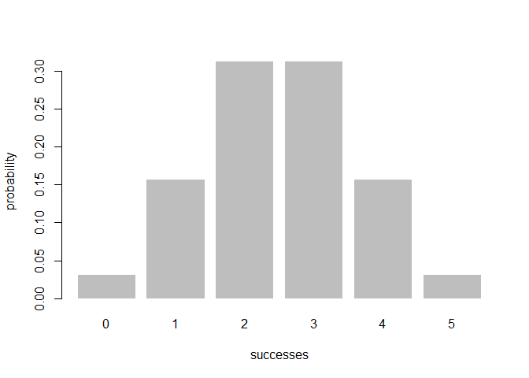

<!-- README.md is generated from README.Rmd. Please edit that file -->
Overview
--------

------------------------------------------------------------------------

`"binomial"` is a minimal R pacakge that provides functions to calculate probabilities about the number of successes in a fixed number of random trials performed under identical conditions by adopting "Binomial Distribution" Model.

-   `bin_choose()` calculates the number of combinations in which k successes can happen in n trials.

-   `bin_probability()` calculates the the probability of getting k successes in n trials with the fixed success probability.

-   `bin_distribution()` is able to produce a "bindis" data frame of the probability distribution.

-   `plot()` method for a "bindis" object to plot the probability distribution.

-   `bin_cumulative()` can give a "bincum" data frame with both the probability distribution and the cumulative probabilities.

-   `plot()` method for a "bincum" object to plot the cumulative probability distribution.

-   `bin_variable()` can check the validity of inputs: "prob" and "trials" and return an object of class "binvar"

-   `print()` method for "binvar" can nicely print out an "binvar" object.

-   `summary()` method for "binvar" object generate a full summary description of an object "binvar", including trials, prob, mean, variance, mode, skewness, kurtosis.

-   `print()` method for "summary.binvar" can nicely print out "summary.binvar" objects.

Motivation
----------

------------------------------------------------------------------------

This package has been developed to conveniently use the "Binomial Distribution" to calculate the probability of certain situations.

Installation
------------

------------------------------------------------------------------------

Install the development version from GitHub via the package "devtools":

``` r
# development version from GitHub:
#install.packages("devtools") 

# install "binomial" (without vignettes)
devtools::install_github("stat133-sp19/hw-stat133-luzhangberkeley/workout03/binomial")
#> Skipping install of 'binomial' from a github remote, the SHA1 (387514f8) has not changed since last install.
#>   Use `force = TRUE` to force installation

# install "cointoss" (with vignettes)
devtools::install_github("stat133-sp19/hw-stat133-luzhangberkeley/workout03/binomial", build_vignettes = TRUE)
#> Skipping install of 'binomial' from a github remote, the SHA1 (387514f8) has not changed since last install.
#>   Use `force = TRUE` to force installation
```

Usage
-----

``` r
library(binomial)

# The number of combinations in which 2 successes can occur in 5 trials
bin_choose(n = 5, k = 2)
#> [1] 10

# Probability of getting 2 successes in 5 trials(assuming prob of success = 0.5)
bin_probability(success = 2, trials = 5, prob = 0.5)
#> [1] 0.3125

# Binomial probability distribution
dis1 <- bin_distribution(trials = 5, prob = 0.5)

# Use `plot` method for "bindis"" objects to graphs the probability histogram
plot(dis1)
```



``` r

# Give a data frame with both the probability distribution and the cumulative probabilities
dis2 <- bin_cumulative(trials = 5, prob = 0.5)
dis2
#>   success probability cumulative
#> 1       0     0.03125    0.03125
#> 2       1     0.15625    0.18750
#> 3       2     0.31250    0.50000
#> 4       3     0.31250    0.81250
#> 5       4     0.15625    0.96875
#> 6       5     0.03125    1.00000

# Use plot() method for a "bincum" object to plot the cumulative probability distribution.
plot(dis2)
```


``` r

# Function bin_variable() will help check the validity of these two inputs.
bin1 <- bin_variable(trials = 10, prob = 0.3)

# print() method for "binvar" can nicely print out "binvar" objects.
print(bin1)
#> "Binomial variable"
#> 
#> Parameters
#> - number of trials: 10 
#> - prob of success: 0.3

# summary() method for "binvar" can give a full summary description of the "binvar" object
summary(bin1)
#> "Binomial variable"
#> 
#> Parameters
#> - number of trials: 10 
#> - prob of success: 0.3 
#> 
#> Measures
#> - mean    : 3 
#> - variance: 2.1 
#> - mode    : 3 
#> - skewness: 0.2760262 
#> - kurtosis: -0.1238095

# print() method for "summary.binvar" can nicely print out "summary.binvar" objects.
print(bin1)
#> "Binomial variable"
#> 
#> Parameters
#> - number of trials: 10 
#> - prob of success: 0.3
```
